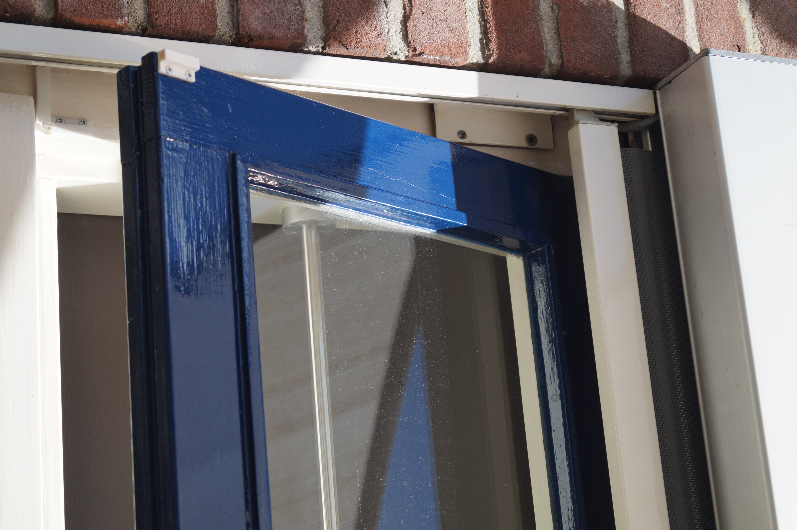
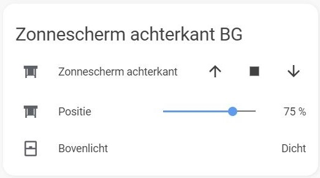

# esphome-protected-cover
This project is based on a (modified) Shelly 2.5. The software is based on ESPHome with a custom cover component. I've implemented a time based cover and used a reed switch to detect the window status. The cover won't do anything when the window is open. At the end, the cover can be operated intuitively with Home Assistant.

In my case, the application is as follows:

 

## Hardware preparation
> NOTE: Any modifications to your hardware and the use of this software is at your own risk.

In my case, I am not using the SW inputs on the Shelly to control the cover with existing buttons. So I decided to use the screw terminals from SW1 and SW2 to connect my reed switch to. The SW1 input will be used as GND and SW2 input will be connected to GPIO0. To do so, start with removing the 47k&Omega; resistors (R13 and R14).

The next step is to connect the screw terminals to GND and GPIO0. Both exists on the program header, so you can connect those pins to the screw terminals with some wires. Be aware to make no short circuits! You can solder the GND wire to a more accessible place, of course.

You can now attach your reed switch easily to your Shelly!

## Software
### ESPHome
Use your favourite UART-USB converter to upload the ESPHome configuration to your Shelly. You can use the legs of three resistors to fit in the program header. Solder the other ends to a pinheader and connect it to the UART-USB converter.

Place the cover_with_window.h file in your `/esphome` directory. Mine is at `/config/esphome`.

Create a new node when using the ESPHome add-on. An example configuration is in [esphome_config.yaml](esphome_config.yaml). The `binary_sensor:` component is used to expose the window status to Home Assistant.

### Home Assistant
The cover is automaticaly detected by Home Assistant and can be set up via the integration page. To use the cover a bit more intuitive, I've created one template cover to invert the arrrows. The other template cover is used to control the cover with a slider. [Both template covers](HA_config.yaml) are using custom icons, so they look both nicely in Lovelace. I used the custom component [slider-entity-row](https://github.com/thomasloven/lovelace-slider-entity-row) to show the slider in Lovelace.

The custom_icons 'component' is based on [the twelfth post by @fanaticDavid from this issue](https://github.com/Armaell/home-assistant-custom-icons-loader/issues/5).
If you want to use my custom icons, place the `/custom_icons` folder in the `/www/community` folder. Add `/hacsfiles/custom_icons/custom_icons.js` as a resource to your Lovelace dashboard.

You can now control your cover without having the risk of damaging your cover (or window)!

